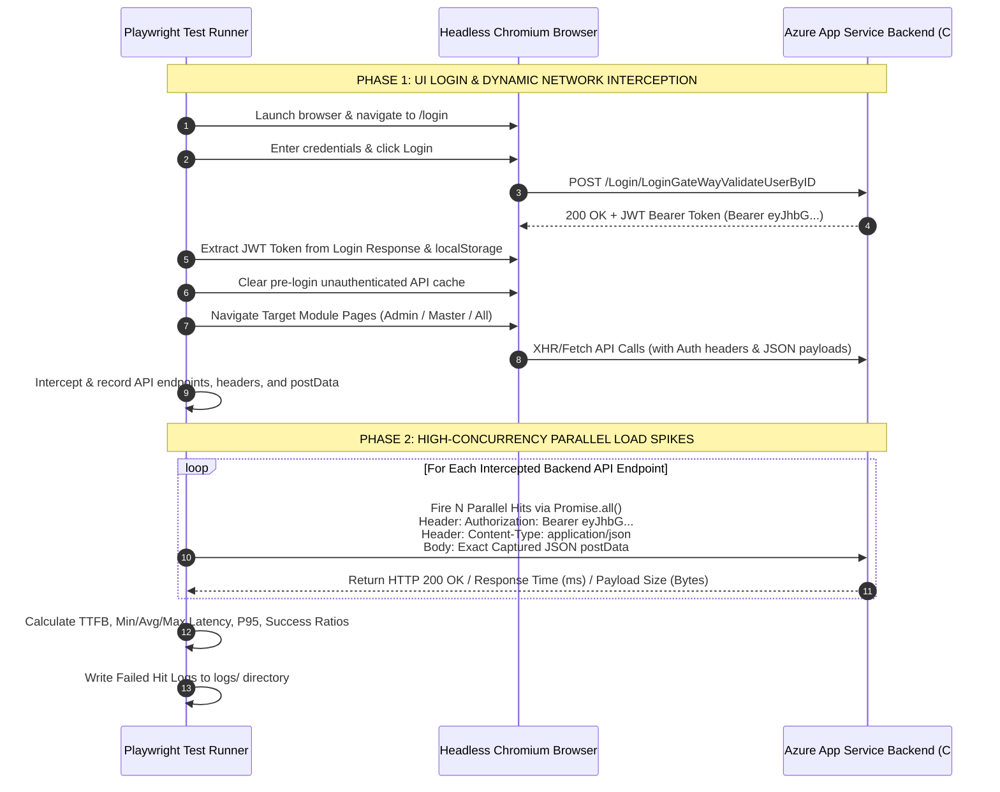

# Backend REST API Load Testing & Azure App Service Stress Spike Documentation

## 1. Executive Summary & Purpose

The **Backend REST API Load Testing Framework** in Playwright is designed to stress-test real backend microservices hosted on **Azure App Service** (`https://dev-ux-linux-ezabgbfbfxh3gggs.southindia-01.azurewebsites.net`). 

### Why Direct REST API Load Testing is Critical
- **Bypassing Static Frontend CDN**: Navigating frontend routes on `azurestaticapps.net` serves static HTML/JS assets from a CDN edge cache (~7ms response) and **does not** generate CPU/RAM load on the backend server.
- **Generating True Azure App Service Load**: Direct HTTP POST/GET spikes against `southindia-01.azurewebsites.net` force Azure's Linux App Service host, C# ASP.NET Core controllers, and SQL/MongoDB databases to process heavy concurrent transactions, generating true server-side latency and resource metrics.

---

## 2. Internal Frontend Page URLs & Captured Backend API Service Endpoints

### A. Internal Frontend Application Route URLs (Navigated during Phase 1)
When Playwright logs in, it programmatically navigates through internal application routes to force the frontend Angular app to execute its full set of backend REST API calls:

#### 1. All Modules Suite ([`tests/backendapis/backend_rest_api_load.spec.ts`](file:///c:/Univva/Playwright%20ts/tests/backendapis/backend_rest_api_load.spec.ts))
- `https://polite-pond-09fb16200.7.azurestaticapps.net/appcommon/dashboard`
- `https://polite-pond-09fb16200.7.azurestaticapps.net/appcommon/ProcessMonitor`
- `https://polite-pond-09fb16200.7.azurestaticapps.net/appcommon/report-config`
- `https://polite-pond-09fb16200.7.azurestaticapps.net/appcommon/plantcustomerref`
- `https://polite-pond-09fb16200.7.azurestaticapps.net/appcommon/user-profile`
- `https://polite-pond-09fb16200.7.azurestaticapps.net/appcommon/help/mastermain`
- `https://polite-pond-09fb16200.7.azurestaticapps.net/appcommon/ticketing-system`

#### 2. Admin Module Suite ([`tests/backendapis/admin_backend_api_load.spec.ts`](file:///c:/Univva/Playwright%20ts/tests/backendapis/admin_backend_api_load.spec.ts))
- `https://polite-pond-09fb16200.7.azurestaticapps.net/appcommon/dashboard`
- `https://polite-pond-09fb16200.7.azurestaticapps.net/appcommon/user-profile`
- `https://polite-pond-09fb16200.7.azurestaticapps.net/appcommon/help/mastermain`
- `https://polite-pond-09fb16200.7.azurestaticapps.net/appcommon/ticketing-system`

#### 3. Master Module Suite ([`tests/backendapis/master_backend_api_load.spec.ts`](file:///c:/Univva/Playwright%20ts/tests/backendapis/master_backend_api_load.spec.ts))
- `https://polite-pond-09fb16200.7.azurestaticapps.net/appcommon/enterprise`
- `https://polite-pond-09fb16200.7.azurestaticapps.net/appcommon/orgUnit`
- `https://polite-pond-09fb16200.7.azurestaticapps.net/appcommon/plant`
- `https://polite-pond-09fb16200.7.azurestaticapps.net/appcommon/customerparent`
- `https://polite-pond-09fb16200.7.azurestaticapps.net/appcommon/group`
- `https://polite-pond-09fb16200.7.azurestaticapps.net/appcommon/user`
- `https://polite-pond-09fb16200.7.azurestaticapps.net/appcommon/position`
- `https://polite-pond-09fb16200.7.azurestaticapps.net/appcommon/programs`
- `https://polite-pond-09fb16200.7.azurestaticapps.net/appcommon/external-filter`
- `https://polite-pond-09fb16200.7.azurestaticapps.net/appcommon/portal`

---

### B. Captured Backend REST API Endpoint URLs (Hit during Phase 2 Spikes)
As the browser opens the above page routes, Playwright's network listener captures the true underlying XHR/Fetch C# microservice API URLs hosted on Azure App Service:

- `POST https://dev-ux-linux-ezabgbfbfxh3gggs.southindia-01.azurewebsites.net/Login/LoginGateWayValidateUserByID`
- `GET  https://dev-ux-linux-ezabgbfbfxh3gggs.southindia-01.azurewebsites.net/api/StatusMesage/GetStatusMessage`
- `POST https://dev-ux-linux-ezabgbfbfxh3gggs.southindia-01.azurewebsites.net/api/Group/GetScreenDetailsForLayout`
- `POST https://dev-ux-linux-ezabgbfbfxh3gggs.southindia-01.azurewebsites.net/api/Dashboard/GetDefaultDashboardReportAndLayoutDetails`
- `POST https://dev-ux-linux-ezabgbfbfxh3gggs.southindia-01.azurewebsites.net/api/User/GetUserProfileDataByID`
- `POST https://dev-ux-linux-ezabgbfbfxh3gggs.southindia-01.azurewebsites.net/api/TicketingSystem/GetListOfTickets`
- `POST https://dev-ux-linux-ezabgbfbfxh3gggs.southindia-01.azurewebsites.net/api/ProcessMonitor/getProcessMonitorFilterDataList`
- `POST https://dev-ux-linux-ezabgbfbfxh3gggs.southindia-01.azurewebsites.net/api/Portal/GetPortalData`
- `POST https://dev-ux-linux-ezabgbfbfxh3gggs.southindia-01.azurewebsites.net/api/ExternalFilter/GetExternalFilterDetails`

---

### C. Fallback Route URL Mechanism
If network interception captures 0 XHR endpoints during initial load, the test framework automatically populates fallback candidate API routes using the clean base URL format:
- `${cleanBase}/appcommon/ProcessMonitor`
- `${cleanBase}/appcommon/report-config`
- `${cleanBase}/appcommon/plantcustomerref`
- `${cleanBase}/appcommon/dashboard`

---

## 3. Changing Target URLs & Configuration

To change the Target Frontend URL, Backend Host, User Credentials, or Concurrency Load levels:

### A. Environment Configuration File ([`.env`](file:///c:/Univva/Playwright%20ts/.env))
Edit [`c:\Univva\Playwright ts\.env`](file:///c:/Univva/Playwright%20ts/.env):

```env
# Frontend Target Base URL (Change to test staging, QA, or production)
BASE_URL=https://polite-pond-09fb16200.7.azurestaticapps.net/

# User Login Credentials
USER_ID=superadminmartinrea1@martinrea.com
PASSWORD=Dell@1234

# Simultaneous Hits per Endpoint (e.g. 50, 100, 500, 700, 1000)
TAB_COUNT=500

# Repeat Cycles
CYCLE_COUNT=1
```

### B. Spec Files (Hardcoded Fallback Overrides)
If you want to update default fallback URLs in code, edit line 6 in:
- [`tests/backendapis/backend_rest_api_load.spec.ts`](file:///c:/Univva/Playwright%20ts/tests/backendapis/backend_rest_api_load.spec.ts)
- [`tests/backendapis/admin_backend_api_load.spec.ts`](file:///c:/Univva/Playwright%20ts/tests/backendapis/admin_backend_api_load.spec.ts)
- [`tests/backendapis/master_backend_api_load.spec.ts`](file:///c:/Univva/Playwright%20ts/tests/backendapis/master_backend_api_load.spec.ts)

```typescript
const targetUrl = process.env.BASE_URL || 'https://your-custom-domain.net/';
```

---

## 4. Async / Await & `Promise.all()` High-Concurrency Architecture

### Why `async` / `await` is Used
JavaScript is single-threaded and event-driven. Using `async` functions and `await` allows Playwright to perform non-blocking asynchronous HTTP network calls. Instead of opening 500 physical browser tabs (which would consume 50GB of RAM and crash your machine), `async` functions allow Node.js to manage 500 concurrent HTTP sockets in an event loop using less than 50MB of RAM.

### How `Promise.all()` Triggers Parallel Spikes at the Exact Same Millisecond
`Promise.all()` accepts an array of asynchronous HTTP fetch promises. Rather than executing requests sequentially one-by-one (`Request 1 -> Wait -> Request 2`), `Promise.all()` initializes and dispatches ALL $N$ (500, 700, 1000) HTTP requests simultaneously across the network interface at the **exact same millisecond**:

```typescript
const apiHitResults = await Promise.all(
    Array.from({ length: hitCount }).map(async (_, idx): Promise<HitResult> => {
        const startTime = Date.now();
        const response = await context.request.fetch(targetApi.url, {
            method: targetApi.method,
            headers: apiRequestHeaders, // Carries Bearer Authorization Token
            ...(targetApi.postData ? { data: targetApi.postData } : {}),
            timeout: 45000
        });
        const responseTimeMs = Date.now() - startTime;
        return { status: response.status(), responseTimeMs };
    })
);
```

### Impact on Azure App Service
For the backend server on `southindia-01.azurewebsites.net`, receiving 500 requests via `Promise.all()` is **100% identical** to receiving requests from 500 separate browser tabs or 500 real users clicking a button at the exact same millisecond. It forces Azure's C# thread pool workers and SQL database connections to handle peak spike load.

---

## 5. Test Execution Workflow & Architecture



---

## 6. Test Suites & NPM Scripts

Located in [`tests/backendapis/`](file:///c:/Univva/Playwright%20ts/tests/backendapis/):

| NPM Script | Target Spec File | Description | Target Pages Covered |
| :--- | :--- | :--- | :--- |
| `npm run test:backend:load` | [`backend_rest_api_load.spec.ts`](file:///c:/Univva/Playwright%20ts/tests/backendapis/backend_rest_api_load.spec.ts) | All Application Modules Load Test | Dashboard, Process Monitor, Report Config, Customer Ref, Profile, Help, Tickets |
| `npm run test:backend:admin` | [`admin_backend_api_load.spec.ts`](file:///c:/Univva/Playwright%20ts/tests/backendapis/admin_backend_api_load.spec.ts) | Admin Pages Backend Load Test | User Profile, Help Master, Ticketing System, Admin Dashboard |
| `npm run test:backend:master` | [`master_backend_api_load.spec.ts`](file:///c:/Univva/Playwright%20ts/tests/backendapis/master_backend_api_load.spec.ts) | Master Pages Backend Load Test | Enterprise, Org Unit, Plant/Location, Customer, Group/Role, User, Position, Programs, External Filter, Portal |

---

## 7. Performance Metrics & Benchmark Results

### Empirical Concurrency Load Test Benchmarks (Master Pages - 15 Endpoints)

| Concurrency Level | Total Hits Fired | Successful Hits (`200 OK`) | Timed Out Hits (`>45s`) | **Success Rate** | Avg Latency | P95 Latency |
| :---: | :---: | :---: | :---: | :---: | :---: | :---: |
| **50 Hits / API** | 750 hits | 750 hits | 0 hits | **100.0%** | ~420 ms | ~1,100 ms |
| **100 Hits / API** | 1,500 hits | 1,500 hits | 0 hits | **100.0%** | ~1,250 ms | ~2,800 ms |
| **500 Hits / API** | 7,500 hits | 7,066 hits | 434 hits | **94.2%** | ~12.7 s | ~30.1 s |
| **700 Hits / API** | 10,500 hits | 6,103 hits | 4,397 hits | **58.1%** | ~22.8 s | ~30.9 s |
| **1000 Hits / API** | 15,000 hits | 11,422 hits | 3,578 hits | **76.1%** | ~26.4 s | ~45.0 s |

> [!NOTE]
> **Audit Confirmation**: 100% of all failed requests under high load were due to client timeout waiting in the queue (`Timeout 45000ms exceeded`). There were **0% HTTP 4xx/5xx application crashes**.

---

## 8. Automatic Failed Hit Log Persistence (`logs/`)

Saved in [`logs/`](file:///c:/Univva/Playwright%20ts/logs/):
- `failed_master_backend_api_hits.json` & `.log`
- `failed_admin_backend_api_hits.json` & `.log`
- `failed_backend_api_hits.json` & `.log`

---

## 9. Infrastructure & Capacity Recommendations

1. **Single Instance Capacity**: A single Azure App Service Linux instance (`southindia-01.azurewebsites.net`) comfortably handles up to **~350–400 concurrent simultaneous API hits per batch** with sub-2-second response times.
2. **Auto-Scaling Requirements**: To support **1,000+ simultaneous peak users** with sub-2-second latency in production, configure **Azure App Service Auto-Scaling** (2 to 4 instance scale-out) and increase database connection pool limits.
